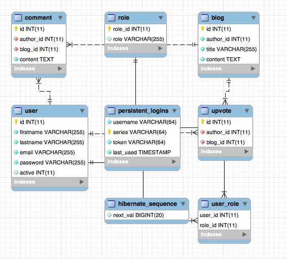
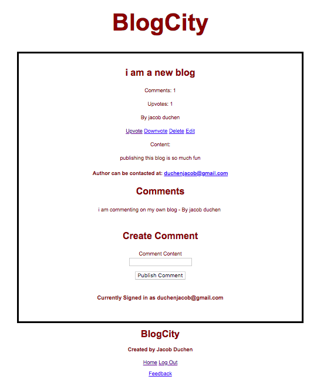

This project, "CityBlog", is a blog system built with SpringBoot, SpringMVC, Spring Security, JDBC/JPA, MySql/Oracle, J Unit testing, and the views are Thymeleaf/JSPs. The blog aspect of the web app has full CRUD functionality, upvotes can be created and deleted, but comments currently can only be created (this is still a work in progress). As I am currently learning Spring, I experimented getting functionality working in different technologies (Oracle and mySql, JPA and JDBC, JSP and Thymeleaf)

To get the project running:

-Git clone this repo
-Create a database
-Run each script in the appropriate sql scripts folder
-Import project in your preferred Java IDE
-Run project as SpringBoot project however you like

Here are a few of my initial user stories that I used when planning the project:

General User Stories

-Users can read blogs
-Users can write blogs
-Users can update and delete their own blogs
-Users can comment and upvote blogs of other authors.
-Users need to login to use system.
-Users need to signup to use system.

More Specific User Stories

-As an author, I must be able to both write blogs and read the blogs of others.

-As an author, I must be able to create, read, update, and delete blogs.

-As a reader, I must be able to read other blogs.

-As a reader, I must be able to upvote (or “clap” as on Medium.com) blogs.  

-As a reader, I must be able to see most popular blogs by upvotes.

Should Have

-As a user, I should be authenticated when using the website.

Could Have

-As a user, I could be able to insert images, and other popular types of media into blogs that I write.

-As a reader I must be able to search blogs by category/tags.

-As an author, I could be able to add tags, or categories, to blogs that I write.

Things that are still being worked on:

-The UX and CSS is very poor and needs to be updated

-There is still much refactoring in the Controllers and Services that could be done to make the project more readable and efficient

-I am in the process of removing JPA from the security configuration as JDBC is wanted. JPA is used to configure Spring Security and datasource currently. JDBC is used for the rest of the projects CRUD functionality.

-I used mySql during the development of the project and plan on replacing it with Oracle.

Here is an image of our current schema:

-Comment delete functionality

-Comment to Comment relationship functionality

-Non-text in blogs functionality

-Tags features

-Online Deployment

Here are some other screenshots of the projects in its crude state:

