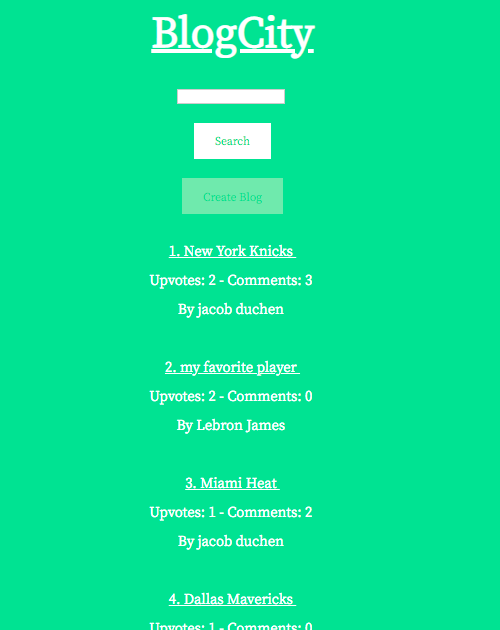

# BlogCity

Deployed here: <a href="http://blogcity-env.3tdirw32mi.us-east-1.elasticbeanstalk.com/" alt="link to aws beanstalk project">BlogCity</a>
(The RDS and EB instances are currently stopped so if you would like to message me to try out the app I am happy to un-stop them)

This project, "BlogCity", is a blog system built with Java 8, SpringBoot, SpringMVC, Spring Security, JDBC, Oracle SQL, AWS RDS, J Unit testing, JSP, and it is deploying on AWS Beanstalk. The blog aspect of the web app has full CRUD functionality, upvotes can be created and deleted, and comments can be created and deleted.

As I am relatively new to Spring and its associated technologies, I spent time learning a few other technologies while developing this project. If you go into this repo's commit history, you will notice I actually built out this project with JPA, Hibernate, MySql, and Thymeleaf initially before replacing those technologies with the ones I ultimately needed.

### To Install Project With Your Own Database

-Git clone this repo

-Create a database in your SQL system (mysql or oracle scripts are in folders in the repo). To use MySql, you will have to choose to uncomment the mysql dependency in Springboot app pom.xml and adjust application.properties settings with appropriate MySql driver)

-Run each script in the appropriate sql scripts folder (mysql or oracle). First auth scripts, then blog script, then comment, then upvotes, then wordinblogs scripts.

-Go to blog folder and import it into preferred Java IDE

-Add your user credentials in project's application.properties file (database name, username, password)

-Run project as SpringBoot project however you like

-This project's sql will crash with nullpointer errors if there is not one item created in database to start. So, via your sql tool (mysql workbench, Oracle SqlDeveloper, whatever tool you prefer) insert a user (with a pre-bcrypted password), blog, comment, upvote, and wordinblog with the appropriate values. (I plan on adjusting SQL scripts in future so people don't have to do this)

### Things that are still being worked on:

-The UX/UI is still a work in progress.

-I occasionally get SQL errors if you test the flawed logic of my system. So as those flaws are discovered, the system will need to be continually updated.

-There is still much refactoring in the Controllers and Services that could be done to make the project more readable and efficient

-I am passing a lot of repetitive information to the JSP's from the controller. I will reduce that going forward.

-Comment to Comment relationship functionality

-Non-text in blogs functionality

-Improving this readme to better help people looking to copy and learn from project

-Better error handling

# Here are a few of my initial user stories that I used when planning the project:

### General User Stories

-Users can read blogs

-Users can write blogs

-Users can update and delete their own blogs

-Users can comment and upvote blogs of other authors.

-Users need to login to use system.

-Users need to signup to use system.

-Users can add tags to the blogs

# More Specific User Stories

### Must Have

-As an author, I must be able to both write blogs and read the blogs of others.

-As an author, I must be able to create, read, update, and delete blogs.

-As a reader, I must be able to read other blogs.

-As a reader, I must be able to upvote (or “clap” as on Medium.com) blogs.  

-As a reader, I must be able to see most popular blogs by upvotes.

### Should Have

-As a user, I should be authenticated when using the website.

### Could Have

-As a user, I could be able to insert images, and other popular types of media into blogs that I write.

-As a reader I must be able to search blogs by category/tags.

-As an author, I could be able to add tags, or categories, to blogs that I write.

### Basic Plans For Page Layouts

<!-- {:height="150px"}. -->

### Plans For Schema

<!--  -->

### Taken from my MySql Development Database Early in Development

<!--  -->

# Reflecting on This Project

I learned a lot completing this project. Most of the "magic" under the hood in Spring is still foreign to me, but I can confidently say I know what every line of code typed does in this project which is a great personal achievement for me.

Initially, I had planned on having blog-author's input tags to enable users to search for blogs with those tags. Most of the blogs I read currently (Medium, Hacker News, Bloomberg, Twitter, Reddit, Etc.) don't really use tags and I thought I would accomplish this requirement without requiring users to input tags manually. Instead of having a blog author input tags, when a blog is published, BlogCity gets all unique words from that blog, and stores them in a table with word and blog_id. Then, when a user decides to search for a term, for example, "basketball", we retrieve all blogs that have the word, "basketball", in them. When blogs are updated or deleted, we update those words accordingly as well. Much like the rest of this project, a lot more can be done to strengthen the business logic of this process but I think it is a cool feature currently.

I was able to accomplish all of my must have user stories. I did accomplish most of my reach goals but I have yet to try implement non-text input objects in blog. I will always remember a Google Developer Expert (I forget his name) say in a conference, "Images basically are the reason why people use the internet," in describing how 90% of internet traffic is really just people sending photos and now videos to each other via various platforms. Being able to upload and send images and/or videos is a functionality a blog in 2018 really just needs to have. Having a written action plan of what to build helped prevent me from getting distracted with building out unnecessary functionalities which was often tempting throughout building project.

### How The Project Currently Looks After CSS Effort

<!--  -->

### Login

<!--  -->

### Signup

<!--  -->

### View Blog

<!--  -->

### How The Project Looked With Initial CSS Effort
### Old Home Page

<!--  -->

### Old Blog

<!--  -->

### Old Signup
<!--  -->

### Old View Blog
<!--  -->

