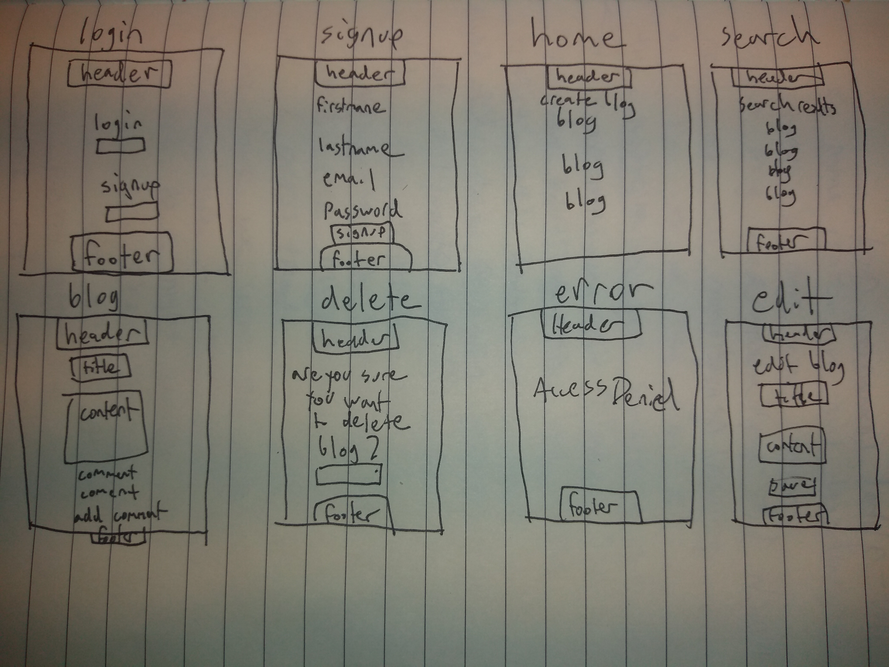
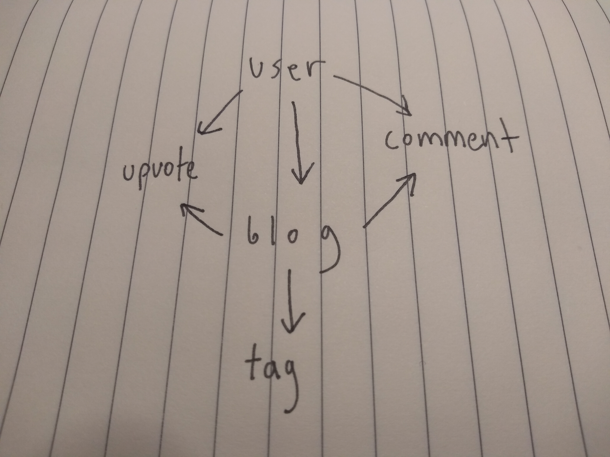
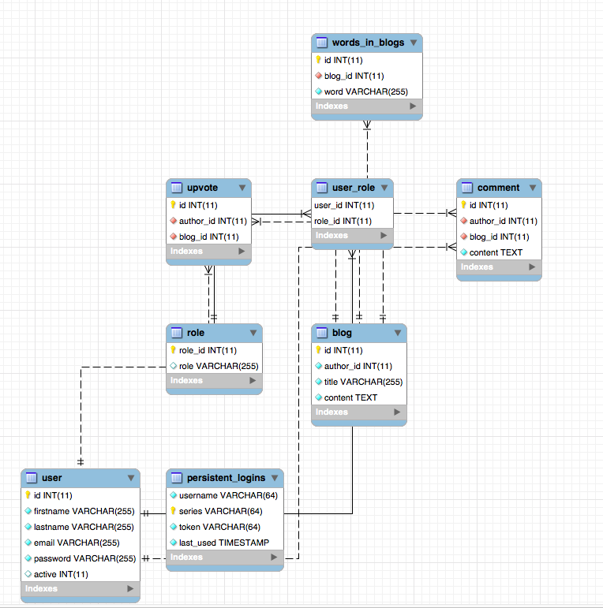
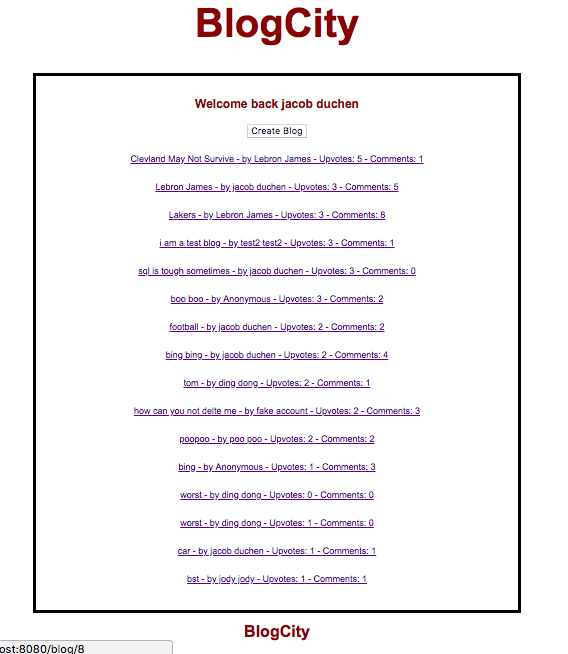
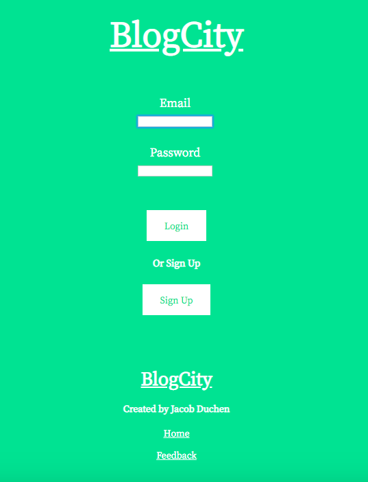
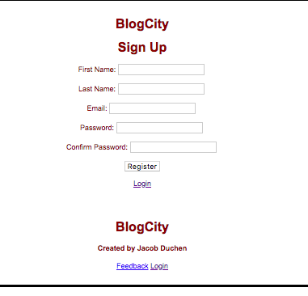
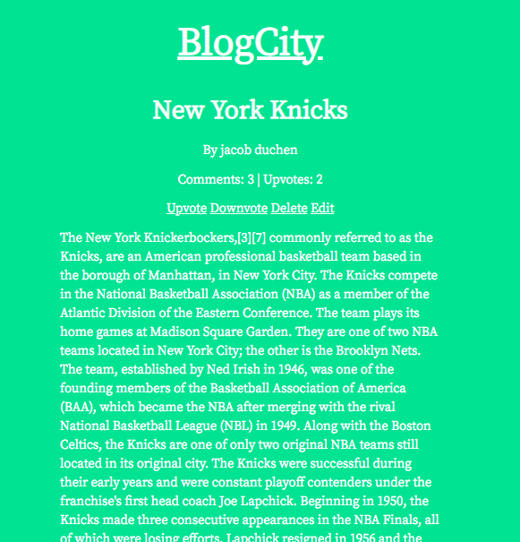
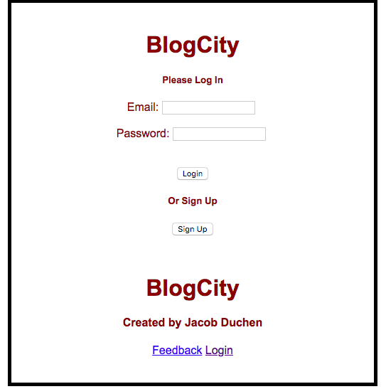
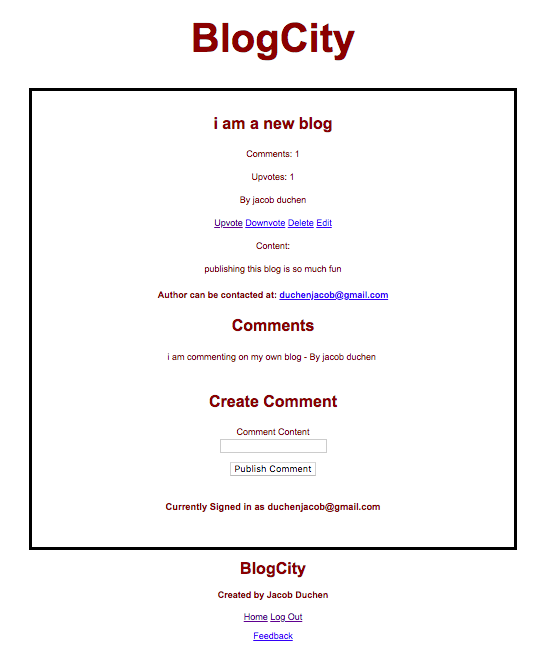

# BlogCity

This project, "BlogCity", is a blog system built with Java 8, SpringBoot, SpringMVC, Spring Security, JDBC, Oracle SQL, J Unit testing, and JSP. The blog aspect of the web app has full CRUD functionality, upvotes can be created and deleted, and comments can be created and deleted.

As I am relatively new to Spring and its associated technologies, I spent time learning a few other technologies while developing this project. If you go into this repo's commit history, you will notice I actually built out this project with JPA, Hibernate, MySql, and Thymeleaf initially before replacing those technologies with the ones I ultimately needed.

### Installing

-Git clone this repo

-Create a database in your SQL system (mysql or oracle scripts are in folders in the repo. You will have to choose to uncomment out the mysql dependency if you want to run it with mysql)

-Run each script in the appropriate sql scripts folder (mysql or oracle). First auth scripts, then blog script, then comment, then upvotes, then wordinblogs scripts.

-Go to blog folder and import it into preferred Java IDE

-Add your user credentials in project's application.properties file (database name, username, password)

-Run project as SpringBoot project however you like

-This project's sql will crash with nullpointer errors if there is not one item created in database to start. So, via your sql tool (mysql workbench, Oracle SqlDeveloper, whatever tool you prefer) insert a user (with a pre-bcrypted password), blog, comment, upvote, and wordinblog with the appropriate values. (I plan on adjusting SQL scripts in future so people don't have to do this)

### Things that are still being worked on:

-The UX/UI is still a work in progress.

-I occasionally get SQL errors if you test the flawed logic of my system. So as those flaws are discovered, the system will need to be continually updated.

-There is still much refactoring in the Controllers and Services that could be done to make the project more readable and efficient

-I am passing a lot of repetitive information to the JSP's from the controller. I will reduce that going forward.

-Comment to Comment relationship functionality

-Non-text in blogs functionality

-Online Deployment

-Improving this readme to better help people looking to copy project

# Here are a few of my initial user stories that I used when planning the project:

### General User Stories

-Users can read blogs

-Users can write blogs

-Users can update and delete their own blogs

-Users can comment and upvote blogs of other authors.

-Users need to login to use system.

-Users need to signup to use system.

-Users can add tags to the blogs

# More Specific User Stories

### Must Have

-As an author, I must be able to both write blogs and read the blogs of others.

-As an author, I must be able to create, read, update, and delete blogs.

-As a reader, I must be able to read other blogs.

-As a reader, I must be able to upvote (or “clap” as on Medium.com) blogs.  

-As a reader, I must be able to see most popular blogs by upvotes.

### Should Have

-As a user, I should be authenticated when using the website.

### Could Have

-As a user, I could be able to insert images, and other popular types of media into blogs that I write.

-As a reader I must be able to search blogs by category/tags.

-As an author, I could be able to add tags, or categories, to blogs that I write.

### Basic Plans For Page Layouts

<!-- {:height="150px"}. -->

### Plans For Schema (taken from my MySql Development Database)

### How The Project Currently Looks After CSS Effort

### How The Project Looked With Initial Crude CSS Effort

